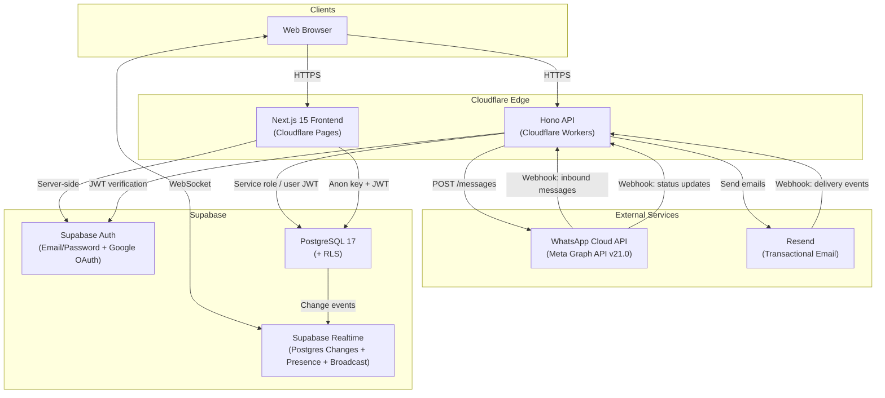
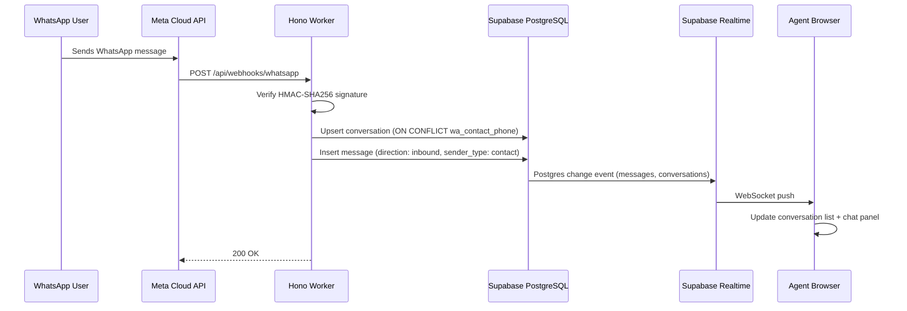
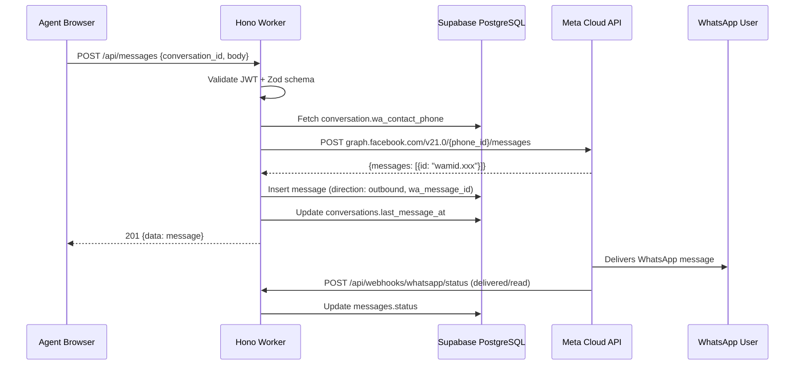
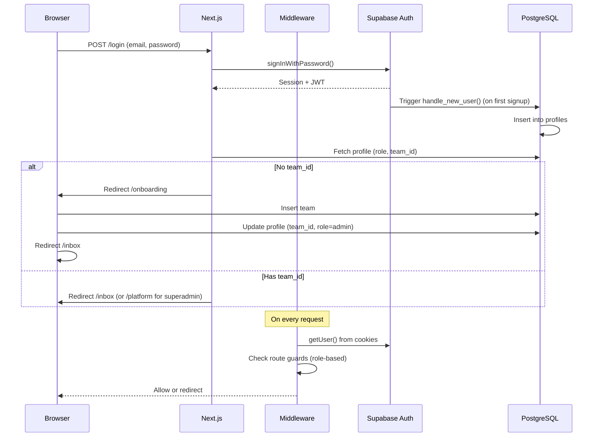
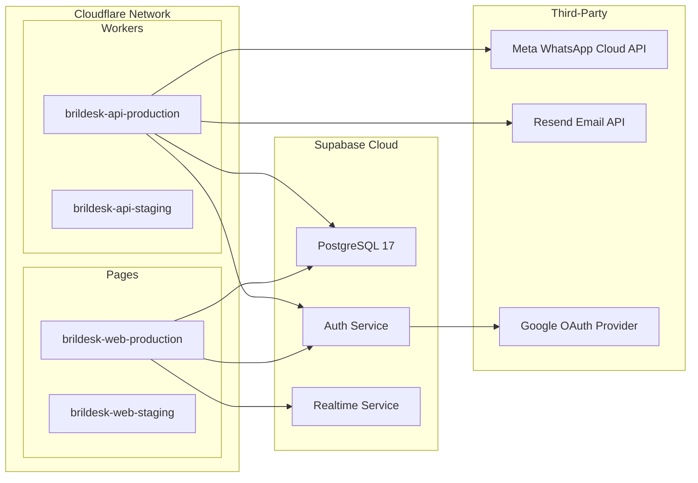

# BrilDesk Architecture

## Overview

BrilDesk is a WhatsApp shared inbox platform that enables teams to collaboratively manage customer conversations via the WhatsApp Business Cloud API. It is built as a monorepo with two deployable applications and two shared internal packages.

## System Architecture



## Monorepo Structure

```
brildesk/
├── apps/
│   ├── api/                    # Hono API on Cloudflare Workers
│   │   ├── src/
│   │   │   ├── index.ts        # Entry point, middleware, route mounting
│   │   │   ├── middleware/
│   │   │   │   └── auth.ts     # JWT auth + role guard middleware
│   │   │   ├── routes/
│   │   │   │   ├── admin.ts        # Admin user/team/stats endpoints
│   │   │   │   ├── beta-signups.ts # Public waitlist signup
│   │   │   │   ├── conversations.ts# Conversation CRUD
│   │   │   │   ├── email.ts        # Email unsubscribe + webhook
│   │   │   │   ├── health.ts       # Health check
│   │   │   │   ├── messages.ts     # Send WhatsApp + internal notes
│   │   │   │   ├── profiles.ts     # User profile endpoints
│   │   │   │   ├── quick-replies.ts# Quick reply templates
│   │   │   │   └── webhooks.ts     # WhatsApp inbound + status
│   │   │   └── services/
│   │   │       ├── email.ts        # Resend email sending service
│   │   │       └── email-templates.ts # HTML email templates
│   │   └── wrangler.toml       # Cloudflare Workers config
│   │
│   └── web/                    # Next.js 15 frontend on Cloudflare Pages
│       ├── src/
│       │   ├── app/
│       │   │   ├── layout.tsx           # Root: wraps in AuthProvider
│       │   │   ├── login/page.tsx       # Login (email + Google OAuth)
│       │   │   ├── signup/page.tsx      # Registration
│       │   │   ├── onboarding/page.tsx  # Team creation flow
│       │   │   ├── (dashboard)/         # Protected route group
│       │   │   │   ├── layout.tsx       # Sidebar nav + mobile tabs
│       │   │   │   ├── inbox/page.tsx   # Main inbox view
│       │   │   │   ├── dashboard/page.tsx
│       │   │   │   ├── reminders/page.tsx
│       │   │   │   ├── admin/page.tsx   # Admin panel
│       │   │   │   └── platform/page.tsx# Superadmin multi-org view
│       │   │   └── api/auth/callback/   # OAuth code exchange (Edge)
│       │   ├── components/
│       │   │   ├── providers/auth-provider.tsx # Auth context
│       │   │   ├── inbox/              # Inbox UI components
│       │   │   └── SimulationBanner.tsx # Superadmin org simulation
│       │   ├── hooks/
│       │   │   ├── use-realtime-conversations.ts
│       │   │   ├── use-realtime-messages.ts
│       │   │   ├── use-reminders.ts
│       │   │   ├── use-presence.ts
│       │   │   └── use-typing-indicator.ts
│       │   └── lib/
│       │       ├── api.ts              # API client functions
│       │       ├── audit.ts            # Audit log helper
│       │       └── supabase/           # Client factories
│       └── wrangler.toml       # Cloudflare Pages config
│
├── packages/
│   ├── shared/                 # @brildesk/shared
│   │   └── src/
│   │       ├── types.ts        # Shared type definitions
│   │       ├── constants.ts    # Enum arrays, pagination defaults
│   │       └── validators.ts   # Runtime validation guards
│   │
│   ├── supabase/               # @brildesk/supabase
│   │   └── src/
│   │       ├── client.ts       # Browser Supabase client
│   │       ├── server.ts       # Server + service-role clients
│   │       └── database.types.ts # TypeScript DB types
│   │
│   ├── tsconfig/               # Shared TypeScript config
│   └── eslint-config/          # Shared ESLint config
│
├── supabase/
│   ├── config.toml             # Supabase project config
│   ├── migrations/             # SQL migration files
│   └── seed.sql                # Development seed data
│
├── turbo.json                  # Turborepo pipeline config
├── pnpm-workspace.yaml         # pnpm workspace definition
└── package.json                # Root scripts
```

**Tooling:** pnpm v10 workspaces + Turborepo v2.5. Node >= 20 required.

## Data Flow Diagrams

### Inbound WhatsApp Message



### Outbound WhatsApp Message



### Authentication Flow



## Deployment Topology



## Key Design Decisions

| Decision | Choice | Rationale |
|---|---|---|
| Monorepo | pnpm + Turborepo | Shared types/config across apps, atomic changes |
| Frontend | Next.js 15 on Cloudflare Pages | SSR + edge rendering, global CDN |
| API | Hono on Cloudflare Workers | Lightweight, edge-native, zero cold start |
| Database | Supabase (PostgreSQL 17) | Managed Postgres with built-in auth, RLS, and realtime |
| Auth | Supabase Auth | Email/password + OAuth, JWT-based, integrates with RLS |
| Realtime | Supabase Realtime | Postgres changes for data sync, Presence for online status, Broadcast for typing |
| WhatsApp | Cloud API v21.0 | Official Meta API for business messaging |
| Email | Resend | Transactional + marketing email with webhook tracking |
| Validation | Zod | Runtime type-safe request validation in API routes |
| Styling | Tailwind CSS v4 | Utility-first, zero runtime, consistent design |
| Multi-tenancy | Row Level Security | Team-scoped data isolation at the database level |

## Security Architecture

- **Authentication:** Supabase Auth issues JWTs; API middleware verifies tokens on every protected request.
- **Authorization:** Four-tier role model (`agent < manager < admin < superadmin`) enforced at both API middleware and database RLS levels.
- **Row Level Security:** All tables have RLS enabled. Two helper functions (`current_user_role()`, `current_user_team_id()`) power team-scoped policies. The service-role key bypasses RLS for webhook processing and admin operations.
- **Webhook verification:** WhatsApp inbound webhooks are verified via HMAC-SHA256 signature. Resend webhooks use a shared secret query parameter.
- **CORS:** API allows only `http://localhost:3000` and `https://app.brildesk.com`.
- **Superadmin simulation:** Superadmins can view any organization's data via client-side team switching (stored in `sessionStorage`). This is safe because the superadmin RLS policy grants full access to all rows regardless of `team_id`.

## Realtime Architecture

BrilDesk uses three Supabase Realtime features:

1. **Postgres Changes** — Tables `messages`, `conversations`, `profiles`, and `reminders` are added to the `supabase_realtime` publication. Frontend hooks subscribe to filtered channels (e.g., `conversations:team:<teamId>`) and update local state on INSERT/UPDATE/DELETE events.

2. **Presence** — Each authenticated user tracks their online status on channel `presence:team:<teamId>`. Auto-away detection triggers after 5 minutes of inactivity (no mouse/keyboard/scroll/touch events).

3. **Broadcast** — Typing indicators use channel `typing:conversation:<id>` with `typing` and `stop_typing` events. Typing users are auto-cleared after 3 seconds of silence.
