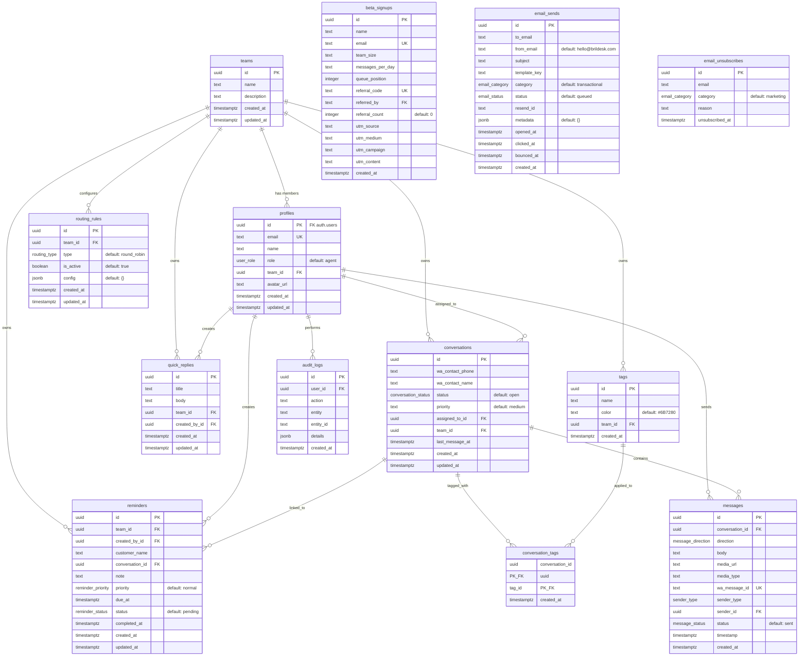

# BrilDesk Database Schema

## Overview

BrilDesk uses Supabase (PostgreSQL 17) with Row Level Security (RLS) for multi-tenant data isolation. The schema is managed through sequential SQL migration files in `supabase/migrations/`.

## Entity Relationship Diagram

## Enums

| Enum | Values |
|---|---|
| `user_role` | `agent`, `manager`, `admin`, `superadmin` |
| `conversation_status` | `open`, `waiting`, `resolved`, `closed` |
| `message_direction` | `inbound`, `outbound` |
| `sender_type` | `contact`, `agent`, `system` |
| `message_status` | `sent`, `delivered`, `read`, `failed` |
| `routing_type` | `round_robin`, `least_busy`, `manual` |
| `reminder_status` | `pending`, `completed`, `dismissed` |
| `reminder_priority` | `normal`, `high`, `urgent` |
| `email_status` | `queued`, `sent`, `delivered`, `opened`, `clicked`, `bounced`, `complained` |
| `email_category` | `transactional`, `marketing` |

## Table Details

### `teams`

Workspace / organization unit. Every agent belongs to exactly one team.

| Column | Type | Nullable | Default | Notes |
|---|---|---|---|---|
| `id` | uuid | NOT NULL | `uuid_generate_v4()` | PK |
| `name` | text | NOT NULL | — | |
| `description` | text | NULL | — | |
| `created_at` | timestamptz | NOT NULL | `now()` | |
| `updated_at` | timestamptz | NOT NULL | `now()` | auto-updated by trigger |

---

### `profiles`

Extends `auth.users`. One row per authenticated user, created automatically by the `handle_new_user()` trigger.

| Column | Type | Nullable | Default | Notes |
|---|---|---|---|---|
| `id` | uuid | NOT NULL | — | PK, FK -> `auth.users(id)` ON DELETE CASCADE |
| `email` | text | NOT NULL | — | UNIQUE |
| `name` | text | NOT NULL | — | Derived from user metadata or email prefix |
| `role` | `user_role` | NOT NULL | `'agent'` | |
| `team_id` | uuid | NULL | — | FK -> `teams(id)` ON DELETE SET NULL |
| `avatar_url` | text | NULL | — | |
| `created_at` | timestamptz | NOT NULL | `now()` | |
| `updated_at` | timestamptz | NOT NULL | `now()` | auto-updated by trigger |

**Indexes:** `idx_profiles_team_id (team_id)`, `idx_profiles_email (email)`

---

### `conversations`

One row per WhatsApp contact thread.

| Column | Type | Nullable | Default | Notes |
|---|---|---|---|---|
| `id` | uuid | NOT NULL | `uuid_generate_v4()` | PK |
| `wa_contact_phone` | text | NOT NULL | — | WhatsApp phone number |
| `wa_contact_name` | text | NULL | — | Display name from WhatsApp profile |
| `status` | `conversation_status` | NOT NULL | `'open'` | |
| `priority` | text | NOT NULL | `'medium'` | Free-form: low, medium, high |
| `assigned_to_id` | uuid | NULL | — | FK -> `profiles(id)` ON DELETE SET NULL |
| `team_id` | uuid | NULL | — | FK -> `teams(id)` ON DELETE SET NULL |
| `last_message_at` | timestamptz | NULL | — | |
| `created_at` | timestamptz | NOT NULL | `now()` | |
| `updated_at` | timestamptz | NOT NULL | `now()` | auto-updated by trigger |

**Indexes:** `idx_conversations_status_assigned (status, assigned_to_id)`, `idx_conversations_last_msg (last_message_at DESC)`, `idx_conversations_phone (wa_contact_phone)`, `idx_conversations_team_id (team_id)`

---

### `messages`

Every WhatsApp message (inbound or outbound) and internal notes.

| Column | Type | Nullable | Default | Notes |
|---|---|---|---|---|
| `id` | uuid | NOT NULL | `uuid_generate_v4()` | PK |
| `conversation_id` | uuid | NOT NULL | — | FK -> `conversations(id)` ON DELETE CASCADE |
| `direction` | `message_direction` | NOT NULL | — | |
| `body` | text | NULL | — | Message text content |
| `media_url` | text | NULL | — | |
| `media_type` | text | NULL | — | MIME type |
| `wa_message_id` | text | NULL | — | UNIQUE; WhatsApp's message ID |
| `sender_type` | `sender_type` | NOT NULL | — | `contact`, `agent`, or `system` (internal notes) |
| `sender_id` | uuid | NULL | — | FK -> `profiles(id)` ON DELETE SET NULL |
| `status` | `message_status` | NOT NULL | `'sent'` | |
| `timestamp` | timestamptz | NOT NULL | `now()` | |
| `created_at` | timestamptz | NOT NULL | `now()` | |

**Indexes:** `idx_messages_conv_ts (conversation_id, timestamp)`, `idx_messages_wa_msg_id (wa_message_id)`

---

### `routing_rules`

Team-level auto-routing configuration for incoming conversations.

| Column | Type | Nullable | Default | Notes |
|---|---|---|---|---|
| `id` | uuid | NOT NULL | `uuid_generate_v4()` | PK |
| `team_id` | uuid | NOT NULL | — | FK -> `teams(id)` ON DELETE CASCADE |
| `type` | `routing_type` | NOT NULL | `'round_robin'` | |
| `is_active` | boolean | NOT NULL | `true` | |
| `config` | jsonb | NOT NULL | `'{}'` | e.g., `{"lastAssignedIndex": 0}` |
| `created_at` | timestamptz | NOT NULL | `now()` | |
| `updated_at` | timestamptz | NOT NULL | `now()` | auto-updated by trigger |

**Indexes:** `idx_routing_rules_team_id (team_id)`

---

### `quick_replies`

Saved message templates for agents.

| Column | Type | Nullable | Default | Notes |
|---|---|---|---|---|
| `id` | uuid | NOT NULL | `uuid_generate_v4()` | PK |
| `title` | text | NOT NULL | — | Short label |
| `body` | text | NOT NULL | — | Full message text |
| `team_id` | uuid | NULL | — | FK -> `teams(id)` ON DELETE SET NULL |
| `created_by_id` | uuid | NOT NULL | — | FK -> `profiles(id)` ON DELETE CASCADE |
| `created_at` | timestamptz | NOT NULL | `now()` | |
| `updated_at` | timestamptz | NOT NULL | `now()` | auto-updated by trigger |

**Indexes:** `idx_quick_replies_team_id (team_id)`

---

### `audit_logs`

Immutable log of user actions for compliance and tracing.

| Column | Type | Nullable | Default | Notes |
|---|---|---|---|---|
| `id` | uuid | NOT NULL | `uuid_generate_v4()` | PK |
| `user_id` | uuid | NOT NULL | — | FK -> `profiles(id)` ON DELETE CASCADE |
| `action` | text | NOT NULL | — | e.g., `'Note'`, `'Reassign'`, `'Config'` |
| `entity` | text | NOT NULL | — | e.g., `'team'`, `'conversation'` |
| `entity_id` | text | NOT NULL | — | UUID of the affected record |
| `details` | jsonb | NULL | — | Extra context |
| `created_at` | timestamptz | NOT NULL | `now()` | |

**Indexes:** `idx_audit_logs_user_id (user_id)`, `idx_audit_logs_entity (entity, entity_id)`, `idx_audit_logs_created (created_at)`

---

### `tags`

Labels that can be attached to conversations.

| Column | Type | Nullable | Default | Notes |
|---|---|---|---|---|
| `id` | uuid | NOT NULL | `uuid_generate_v4()` | PK |
| `name` | text | NOT NULL | — | |
| `color` | text | NOT NULL | `'#6B7280'` | Hex color |
| `team_id` | uuid | NOT NULL | — | FK -> `teams(id)` ON DELETE CASCADE |
| `created_at` | timestamptz | NOT NULL | `now()` | |

**Indexes:** `idx_tags_team_name` UNIQUE `(team_id, name)`

---

### `conversation_tags`

Junction table linking conversations to tags (many-to-many).

| Column | Type | Nullable | Default | Notes |
|---|---|---|---|---|
| `conversation_id` | uuid | NOT NULL | — | PK, FK -> `conversations(id)` ON DELETE CASCADE |
| `tag_id` | uuid | NOT NULL | — | PK, FK -> `tags(id)` ON DELETE CASCADE |
| `created_at` | timestamptz | NOT NULL | `now()` | |

**Primary key:** composite `(conversation_id, tag_id)`

---

### `reminders`

Scheduled follow-up reminders created by agents.

| Column | Type | Nullable | Default | Notes |
|---|---|---|---|---|
| `id` | uuid | NOT NULL | `gen_random_uuid()` | PK |
| `team_id` | uuid | NOT NULL | — | FK -> `teams(id)` ON DELETE CASCADE |
| `created_by_id` | uuid | NOT NULL | — | FK -> `profiles(id)` ON DELETE CASCADE |
| `customer_name` | text | NOT NULL | — | Free-text name |
| `conversation_id` | uuid | NULL | — | FK -> `conversations(id)` ON DELETE SET NULL |
| `note` | text | NOT NULL | `''` | Reminder body |
| `priority` | `reminder_priority` | NOT NULL | `'normal'` | |
| `due_at` | timestamptz | NOT NULL | — | |
| `status` | `reminder_status` | NOT NULL | `'pending'` | |
| `completed_at` | timestamptz | NULL | — | |
| `created_at` | timestamptz | NOT NULL | `now()` | |
| `updated_at` | timestamptz | NOT NULL | `now()` | auto-updated by trigger |

**Indexes:** `idx_reminders_team_id (team_id)`, `idx_reminders_created_by (created_by_id)`, `idx_reminders_due_at (due_at)`, `idx_reminders_status (status)`

---

### `beta_signups`

Public waitlist capture table. RLS is **not enabled** — accessed only via service-role key.

| Column | Type | Nullable | Default | Notes |
|---|---|---|---|---|
| `id` | uuid | NOT NULL | `uuid_generate_v4()` | PK |
| `name` | text | NOT NULL | — | |
| `email` | text | NOT NULL | — | UNIQUE |
| `team_size` | text | NOT NULL | — | |
| `messages_per_day` | text | NOT NULL | — | Volume estimate |
| `queue_position` | integer | NOT NULL | — | Waitlist position |
| `referral_code` | text | NOT NULL | — | UNIQUE, format `BD-XXXXXX` |
| `referred_by` | text | NULL | — | FK -> `beta_signups(referral_code)` |
| `referral_count` | integer | NOT NULL | `0` | |
| `utm_source` | text | NULL | — | |
| `utm_medium` | text | NULL | — | |
| `utm_campaign` | text | NULL | — | |
| `utm_content` | text | NULL | — | |
| `created_at` | timestamptz | NOT NULL | `now()` | |

**Indexes:** `idx_beta_signups_email (email)`, `idx_beta_signups_referral_code (referral_code)`, `idx_beta_signups_queue_position (queue_position)`

---

### `email_sends`

Tracks every email dispatched via Resend.

| Column | Type | Nullable | Default | Notes |
|---|---|---|---|---|
| `id` | uuid | NOT NULL | `uuid_generate_v4()` | PK |
| `to_email` | text | NOT NULL | — | |
| `from_email` | text | NOT NULL | `'hello@brildesk.com'` | |
| `subject` | text | NOT NULL | — | |
| `template_key` | text | NOT NULL | — | Template identifier |
| `category` | `email_category` | NOT NULL | `'transactional'` | |
| `status` | `email_status` | NOT NULL | `'queued'` | |
| `resend_id` | text | NULL | — | Resend provider message ID |
| `metadata` | jsonb | NOT NULL | `'{}'` | |
| `opened_at` | timestamptz | NULL | — | |
| `clicked_at` | timestamptz | NULL | — | |
| `bounced_at` | timestamptz | NULL | — | |
| `created_at` | timestamptz | NOT NULL | `now()` | |

**Indexes:** `idx_email_sends_to (to_email)`, `idx_email_sends_template (template_key)`, `idx_email_sends_status (status)`, `idx_email_sends_created (created_at)`

---

### `email_unsubscribes`

CAN-SPAM compliance. Records opt-outs per email category.

| Column | Type | Nullable | Default | Notes |
|---|---|---|---|---|
| `id` | uuid | NOT NULL | `uuid_generate_v4()` | PK |
| `email` | text | NOT NULL | — | |
| `category` | `email_category` | NOT NULL | `'marketing'` | |
| `reason` | text | NULL | — | |
| `unsubscribed_at` | timestamptz | NOT NULL | `now()` | |

**Indexes:** `idx_email_unsub_email_cat` UNIQUE `(email, category)`

## Functions

| Function | Returns | Description |
|---|---|---|
| `handle_updated_at()` | trigger | Sets `NEW.updated_at = now()` on every row update |
| `handle_new_user()` | trigger | Fires after `auth.users` INSERT; creates corresponding `profiles` row with name from metadata and default role `'agent'` |
| `current_user_role()` | `user_role` | Returns authenticated user's role from `profiles`. `SECURITY DEFINER`. Used in RLS policies |
| `current_user_team_id()` | uuid | Returns authenticated user's team_id from `profiles`. `SECURITY DEFINER`. Used in RLS policies |

## Triggers

| Trigger | Table | Timing | Function |
|---|---|---|---|
| `set_updated_at` | `teams` | BEFORE UPDATE | `handle_updated_at()` |
| `set_updated_at` | `profiles` | BEFORE UPDATE | `handle_updated_at()` |
| `set_updated_at` | `conversations` | BEFORE UPDATE | `handle_updated_at()` |
| `set_updated_at` | `routing_rules` | BEFORE UPDATE | `handle_updated_at()` |
| `set_updated_at` | `quick_replies` | BEFORE UPDATE | `handle_updated_at()` |
| `set_updated_at` | `reminders` | BEFORE UPDATE | `handle_updated_at()` |
| `on_auth_user_created` | `auth.users` | AFTER INSERT | `handle_new_user()` |

## Row Level Security Policies

### `teams`

| Policy | Command | Rule |
|---|---|---|
| `superadmin_teams` | ALL | `current_user_role() = 'superadmin'` |
| `team_members_select` | SELECT | `id = current_user_team_id()` |
| `admin_teams_update` | UPDATE | `id = current_user_team_id() AND current_user_role() = 'admin'` |
| `authenticated_teams_insert` | INSERT | `true` (authenticated users only, for onboarding) |
| `onboarding_teams_select` | SELECT | `auth.uid() IS NOT NULL AND current_user_team_id() IS NULL` |

### `profiles`

| Policy | Command | Rule |
|---|---|---|
| `superadmin_profiles` | ALL | `current_user_role() = 'superadmin'` |
| `own_profile_select` | SELECT | `id = auth.uid()` |
| `team_profiles_select` | SELECT | `team_id = current_user_team_id()` |
| `admin_profiles_select` | SELECT | `current_user_role() = 'admin'` |
| `own_profile_update` | UPDATE | `id = auth.uid()` |
| `admin_profiles_update` | UPDATE | `team_id = current_user_team_id() AND current_user_role() = 'admin'` |

### `conversations`

| Policy | Command | Rule |
|---|---|---|
| `superadmin_conversations` | ALL | `current_user_role() = 'superadmin'` |
| `agent_conversations_select` | SELECT | Team match AND (manager/admin OR assigned_to self) |
| `agent_conversations_update` | UPDATE | Same as select |
| `manager_conversations_insert` | INSERT | Team match AND role in (manager, admin) |

### `messages`

| Policy | Command | Rule |
|---|---|---|
| `superadmin_messages` | ALL | `current_user_role() = 'superadmin'` |
| `team_messages_select` | SELECT | EXISTS sub-query on conversations (team + role check) |
| `agent_messages_insert` | INSERT | Same EXISTS sub-query |

### `routing_rules`

| Policy | Command | Rule |
|---|---|---|
| `superadmin_routing_rules` | ALL | `current_user_role() = 'superadmin'` |
| `team_routing_rules_select` | SELECT | `team_id = current_user_team_id()` |
| `admin_routing_rules_all` | ALL | Team match AND role = admin |

### `quick_replies`

| Policy | Command | Rule |
|---|---|---|
| `superadmin_quick_replies` | ALL | `current_user_role() = 'superadmin'` |
| `team_quick_replies_select` | SELECT | `team_id = current_user_team_id()` |
| `team_quick_replies_insert` | INSERT | `team_id = current_user_team_id()` |
| `quick_replies_update` | UPDATE | Team match AND (own OR admin) |
| `quick_replies_delete` | DELETE | Same as update |

### `audit_logs`

| Policy | Command | Rule |
|---|---|---|
| `superadmin_audit_logs` | ALL | `current_user_role() = 'superadmin'` |
| `manager_audit_logs_select` | SELECT | Role in (manager, admin) AND same team |
| `user_audit_logs_insert` | INSERT | `user_id = auth.uid()` |

### `tags`

| Policy | Command | Rule |
|---|---|---|
| `superadmin_tags` | ALL | `current_user_role() = 'superadmin'` |
| `team_tags_select` | SELECT | `team_id = current_user_team_id()` |
| `manager_tags_all` | ALL | Team match AND role in (manager, admin) |

### `conversation_tags`

| Policy | Command | Rule |
|---|---|---|
| `superadmin_conversation_tags` | ALL | `current_user_role() = 'superadmin'` |
| `team_conversation_tags_select` | SELECT | EXISTS conversation in same team |
| `team_conversation_tags_insert` | INSERT | EXISTS conversation + team + role check |
| `team_conversation_tags_delete` | DELETE | Same as insert |

### `reminders`

| Policy | Command | Rule |
|---|---|---|
| `reminders_superadmin` | ALL | `current_user_role() = 'superadmin'` |
| `reminders_team_select` | SELECT | `team_id = current_user_team_id()` |
| `reminders_team_insert` | INSERT | `team_id = current_user_team_id()` |
| `reminders_team_update` | UPDATE | `team_id = current_user_team_id()` |
| `reminders_team_delete` | DELETE | `team_id = current_user_team_id()` |

### `email_sends`

| Policy | Command | Rule |
|---|---|---|
| `superadmin_email_sends` | ALL | `current_user_role() = 'superadmin'` |
| `admin_email_sends_select` | SELECT | Role in (admin, manager) |

### `email_unsubscribes`

| Policy | Command | Rule |
|---|---|---|
| `superadmin_email_unsubscribes` | ALL | `current_user_role() = 'superadmin'` |

### `beta_signups`

RLS is **not enabled**. Accessed only via service-role key in the API.

## Realtime Publications

The following tables are added to the `supabase_realtime` publication and emit change events over WebSocket:

- `messages`
- `conversations`
- `profiles`
- `reminders`

## Extensions

- `uuid-ossp` (schema: `extensions`) — provides `uuid_generate_v4()`

## Migration File Index

| Migration | Description |
|---|---|
| `20250516000001_foundation.sql` | Core schema: all primary tables, enums, functions, triggers, RLS policies, realtime publication |
| `20250516000002_beta_signups.sql` | `beta_signups` table for waitlist/referral system |
| `20250516000003_email_infrastructure.sql` | `email_sends` and `email_unsubscribes` tables with email tracking enums |
| `20250516000004_fix_profiles_rls.sql` | Adds `own_profile_select` policy to fix circular RLS dependency |
| `20250518000001_reminders.sql` | `reminders` table with priority/status enums and team-scoped RLS |
| `20250518000002_admin_profiles_select.sql` | Adds `admin_profiles_select` policy for admin panel |
| `20250519000001_signup_policies.sql` | Adds `authenticated_teams_insert` policy for onboarding |
| `20250519000002_fix_onboarding_rls.sql` | Fixes onboarding RLS: recreates teams insert policy, adds `onboarding_teams_select` |
